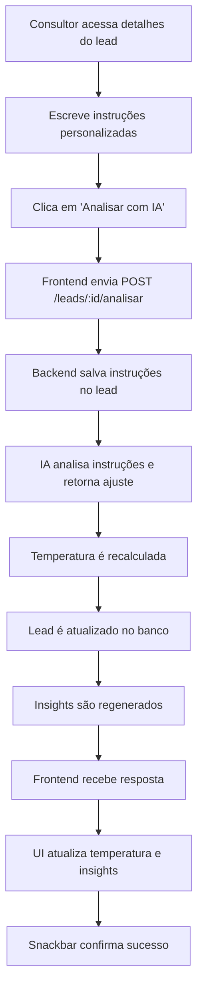

# 🤖 Análise Manual com Instruções Personalizadas

## 📋 Visão Geral

Esta funcionalidade permite que consultores adicionem **instruções personalizadas** para refinar a análise de temperatura de leads usando IA. A IA combina a análise padrão das mensagens com o contexto adicional fornecido pelo consultor para calcular uma temperatura mais precisa.

## 🎯 Objetivo

Permitir que o consultor forneça informações contextuais que não estão explícitas nas mensagens do WhatsApp, mas que são relevantes para determinar o nível de interesse do lead.

## 🚀 Como Usar

### 1. Acessar a Página de Detalhes do Lead

Navegue até: `/app/leads/{leadId}`

### 2. Localizar o Card "Análise Manual com IA"

O card está localizado logo antes do histórico de conversas, com fundo roxo claro.

### 3. Adicionar Instruções Personalizadas

No campo de texto, escreva instruções sobre o lead. Exemplos:

**Instruções que aumentam a temperatura (+):**
- "Lead já comprou consórcio antes e teve boa experiência"
- "Lead tem urgência familiar não explícita nas mensagens"
- "Cliente foi indicado por outro cliente satisfeito"
- "Lead demonstrou interesse real em reunião presencial"
- "Desconsidere as objeções iniciais, ele já demonstrou interesse real"

**Instruções que diminuem a temperatura (-):**
- "Lead está apenas pesquisando preços, sem intenção real"
- "Lead tem histórico de não comparecer em reuniões"
- "Cliente já desistiu 3 vezes antes de fechar"
- "Lead só quer informações para comparar com concorrente"

### 4. Clicar em "Analisar com IA"

O sistema irá:
1. Salvar as instruções personalizadas no banco de dados
2. Recalcular a temperatura do lead usando IA
3. Gerar novo resumo da conversa
4. Atualizar os insights do lead
5. Exibir a nova temperatura

### 5. Verificar Resultado

Após a análise:
- A temperatura do lead será atualizada
- O card de temperatura mostrará o novo valor
- Os insights serão recalculados
- Uma mensagem de sucesso aparecerá

## 🧠 Como Funciona

### Fluxo de Análise

```
1. Consultor escreve instruções personalizadas
   ↓
2. Sistema salva instruções no campo lead.instrucoesPersonalizadas
   ↓
3. IA analisa as instruções e determina um AJUSTE (-30 a +30)
   ↓
4. Ajuste é aplicado à temperatura calculada padrão
   ↓
5. Nova temperatura é salva no lead
   ↓
6. Insights são regenerados
```

### Cálculo da Temperatura

**Temperatura Final = Temperatura Padrão + Ajuste de Instruções Personalizadas**

- **Temperatura Padrão:** Calculada com base em sinais de compra, objeções, sentimento, timing, etc.
- **Ajuste:** Determinado pela IA com base nas instruções (-30 a +30 pontos)
- **Temperatura Final:** Normalizada entre 0 e 100

### Exemplos de Ajustes

| Instrução | Ajuste Esperado |
|-----------|-----------------|
| "Lead já comprou consórcio antes e teve boa experiência" | +15 |
| "Lead tem urgência familiar não explícita" | +10 |
| "Desconsidere objeções iniciais, interesse real" | +12 |
| "Lead apenas pesquisando preços" | -20 |
| "Cliente indicado por outro satisfeito" | +18 |
| "Histórico de não comparecer em reuniões" | -15 |

## 🔧 Implementação Técnica

### Backend

**1. Modelo de Dados**

```javascript
// server/models/lead.js
instrucoesPersonalizadas: {
  type: DataTypes.TEXT,
  allowNull: true,
  comment: 'Instruções personalizadas para análise de IA'
}
```

**2. Migration**

```javascript
// server/migrations/20260117_add_instrucoes_personalizadas_to_leads.js
await queryInterface.addColumn('leads', 'instrucoesPersonalizadas', {
  type: Sequelize.TEXT,
  allowNull: true
});
```

**3. Serviço de IA**

```javascript
// server/services/ia.js

// Função que analisa as instruções e retorna ajuste
async function analisarInstrucoesPersonalizadas(instrucoes, scoreAtual) {
  // Usa GPT para determinar ajuste entre -30 e +30
  // Retorna: { ajuste: 15, justificativa: "..." }
}

// Modificada para aceitar instruções
async function calcularTemperaturaLead(conversaId, instrucoesPersonalizadas = null) {
  // ... cálculo padrão ...
  
  // Aplica ajuste se houver instruções
  if (instrucoesPersonalizadas) {
    const ajuste = await analisarInstrucoesPersonalizadas(instrucoesPersonalizadas, score);
    score += ajuste;
  }
  
  return Math.max(0, Math.min(100, score));
}
```

**4. Controller**

```javascript
// server/controllers/leads.js

async function analisarLeadManualmente(req, res) {
  const { leadId } = req.params;
  const { instrucoesPersonalizadas } = req.body;
  
  // Salva instruções no lead
  lead.instrucoesPersonalizadas = instrucoesPersonalizadas;
  await lead.save();
  
  // Recalcula temperatura com instruções
  const novaTemperatura = await iaService.calcularTemperaturaLead(
    conversa.id,
    lead.instrucoesPersonalizadas
  );
  
  // Atualiza lead
  lead.temperaturaLead = novaTemperatura;
  await lead.save();
  
  // Retorna insights atualizados
}
```

**5. Rota**

```javascript
// server/routers/leads.js
router.post('/:leadId/analisar', leadsController.analisarLeadManualmente);
```

### Frontend

**1. Estado**

```javascript
// app/containers/Pages/Leads/LeadDetalhes.js
const [instrucoesPersonalizadas, setInstrucoesPersonalizadas] = useState('');
const [analisando, setAnalisando] = useState(false);
```

**2. Handler**

```javascript
const handleAnalisarComIA = async () => {
  setAnalisando(true);
  const response = await leadsApi.analisarManualmente(leadId, instrucoesPersonalizadas);
  if (response.sucesso) {
    showSnackbar(`Análise concluída! Nova temperatura: ${response.lead.temperaturaLead}`);
    carregarLead();
    carregarInsights();
  }
  setAnalisando(false);
};
```

**3. UI**

```jsx
<Card sx={{ backgroundColor: '#f3e5f5' }}>
  <CardContent>
    <Box display="flex" alignItems="center" gap={1}>
      <LightbulbIcon color="secondary" />
      <Typography variant="h6">Análise Manual com IA</Typography>
    </Box>
    
    <TextField
      fullWidth
      multiline
      rows={4}
      label="Instruções Personalizadas"
      value={instrucoesPersonalizadas}
      onChange={(e) => setInstrucoesPersonalizadas(e.target.value)}
    />
    
    <Button
      variant="contained"
      color="secondary"
      onClick={handleAnalisarComIA}
      disabled={analisando || !lead}
    >
      {analisando ? 'Analisando...' : 'Analisar com IA'}
    </Button>
  </CardContent>
</Card>
```

**4. API**

```javascript
// app/services/leadsApi.js
analisarManualmente: async (leadId, instrucoesPersonalizadas) => {
  const response = await axios.post(
    `${API_URL}/leads/${leadId}/analisar`,
    { instrucoesPersonalizadas },
    { headers: getAuthHeader() }
  );
  return response.data;
}
```

## 📊 Casos de Uso

### Caso 1: Lead com Urgência Oculta

**Situação:** Lead responde devagar nas mensagens, mas o consultor sabe que ele precisa sair do aluguel urgentemente.

**Instrução:**
```
Lead precisa sair do aluguel até o final do mês. 
Urgência real não aparece nas mensagens.
```

**Resultado:** Temperatura aumenta +10 pontos

---

### Caso 2: Lead Indicado

**Situação:** Lead foi indicado por um cliente satisfeito, mas isso não está nas mensagens.

**Instrução:**
```
Cliente foi indicado por João Silva, que fechou consórcio 
conosco há 6 meses e está muito satisfeito.
```

**Resultado:** Temperatura aumenta +18 pontos

---

### Caso 3: Lead Experiente

**Situação:** Lead já comprou consórcio antes e conhece o processo.

**Instrução:**
```
Lead já comprou consórcio de carro há 3 anos e teve boa experiência. 
Conhece bem o processo e está mais propenso a fechar.
```

**Resultado:** Temperatura aumenta +15 pontos

---

### Caso 4: Lead Descompromissado

**Situação:** Lead já desmarcou 2 reuniões agendadas.

**Instrução:**
```
Lead já desmarcou 2 reuniões nas últimas semanas. 
Histórico de não comparecer.
```

**Resultado:** Temperatura diminui -15 pontos

---

### Caso 5: Pesquisador de Preços

**Situação:** Consultor percebe que lead só quer comparar preços.

**Instrução:**
```
Lead está apenas coletando propostas para comparar com 
outras administradoras. Sem intenção real de fechar agora.
```

**Resultado:** Temperatura diminui -20 pontos

## ⚠️ Boas Práticas

### ✅ Faça

- Seja específico e objetivo nas instruções
- Mencione fatos concretos (reuniões, indicações, histórico)
- Use informações que você tem mas que não estão nas mensagens
- Atualize as instruções quando souber de novas informações
- Use para contextualizar comportamentos que parecem contraditórios

### ❌ Não Faça

- Não repita informações que já estão nas mensagens
- Não use instruções genéricas ("lead parece interessado")
- Não exagere na quantidade de texto (seja conciso)
- Não use para "forçar" uma temperatura desejada
- Não ignore a análise padrão completamente

## 🧪 Testando a Funcionalidade

### Teste 1: Aumentar Temperatura

1. Acesse um lead com temperatura MORNA (40-70)
2. Adicione instrução: "Lead foi indicado por cliente satisfeito"
3. Clique em "Analisar com IA"
4. Verifique se temperatura aumentou

### Teste 2: Diminuir Temperatura

1. Acesse um lead com temperatura QUENTE (70+)
2. Adicione instrução: "Lead apenas pesquisando preços"
3. Clique em "Analisar com IA"
4. Verifique se temperatura diminuiu

### Teste 3: Persistência

1. Adicione instruções e analise
2. Saia da página e volte
3. Verifique se instruções foram salvas

### Teste 4: Sem Instruções

1. Deixe campo vazio
2. Clique em "Analisar com IA"
3. Temperatura deve ser recalculada sem ajuste adicional

## 📝 Logs e Debug

### Logs do Backend

```bash
[IA] Aplicando instruções personalizadas: Lead já comprou consórcio antes...
[IA] Ajuste sugerido pela IA: 15
[IA] Justificativa do ajuste: Lead experiente com histórico positivo
[ANALISE_MANUAL] Nova temperatura calculada: 85
```

### Verificar no Banco

```sql
SELECT 
  id, 
  nome, 
  temperaturaLead, 
  instrucoesPersonalizadas 
FROM leads 
WHERE id = 'lead-uuid';
```

## 🔄 Fluxo Completo



## 🎓 Exemplos de Prompts para IA

A IA recebe um prompt estruturado:

```
Você é um especialista em análise de leads de venda de consórcio.

O lead atualmente tem uma temperatura (score) de 65 pontos (0-100).

O consultor forneceu as seguintes instruções personalizadas:
"Lead já comprou consórcio antes e teve boa experiência. 
Está procurando um segundo consórcio para investimento."

Com base nessas instruções, determine um AJUSTE (positivo ou negativo) 
para a temperatura do lead.

Responda em JSON:
{
  "ajuste": 15,
  "justificativa": "Lead experiente com histórico positivo e intenção clara"
}

O ajuste deve estar entre -30 e +30.
```

## 📚 Referências

- `server/models/lead.js` - Modelo de dados
- `server/services/ia.js` - Lógica de análise
- `server/controllers/leads.js` - Endpoint de análise
- `server/routers/leads.js` - Rota da API
- `app/containers/Pages/Leads/LeadDetalhes.js` - Interface
- `app/services/leadsApi.js` - Cliente da API

---

**Última atualização:** 2026-01-17  
**Versão:** 1.0  
**Autor:** Sistema de Gestão de Leads com IA
